# Phase 6: Cloud Cost Data Cube Specification (`cloud_cost_cube`)

## 1. Overview & Catalog Namespace
The **Cloud Cost Data Cube** (`cloud_cost_cube`) provides a multidimensional analytical engine built on top of the Databricks Delta Lake Data Warehouse (`cloud_cost_catalog.cloud_warehouse`). It enables non-technical decision makers, FinOps analysts, and engineering leads to perform interactive OLAP operations (Roll-up, Drill-down, Slice, Dice, Pivot, Top-N, Time Series) without writing SQL queries.

## 2. Base Data Cube Grain
**Base Grain**:
> `Date` × `Cloud Provider` × `Account` × `Project` × `Organization` × `Region` × `Service` × `Resource Type` × `Environment`

Each cell in the base cube represents the lowest non-aggregated level of cloud expenditure for a specific resource type running in a given region, account, project, and environment on a single date.

## 3. Data Cube Dimensions
The logical data cube includes 12 dimensions:
1. **Date / Time**: Date, Year, Quarter, Month, Month Name, Day of Week, Day
2. **Cloud Provider**: Provider Name (AWS, Azure, GCP), Provider Group
3. **Account**: Cloud Account ID, Account Name
4. **Project**: Project ID, Project Name
5. **Business Unit**: Business Unit Identifier / Name
6. **Department**: Organization Department Name
7. **Cost Center**: Financial Cost Center Code
8. **Region**: Geographic Cloud Region (e.g., us-east-1, eu-west-1)
9. **Service**: Infrastructure Service Category (Compute, Storage, Database, etc.)
10. **Resource Type**: Specific Resource SKU (EC2 instance, S3 bucket, RDS DB, etc.)
11. **Environment**: Deployment stage (production, staging, development)
12. **Currency**: Transaction currency (USD)

## 4. Analytical Hierarchies

```mermaid
graph TD
    subgraph TIME Hierarchy
        Year --> Quarter
        Quarter --> Month
        Month --> Day
    end

    subgraph CLOUD Hierarchy
        CloudProvider --> Account
        Account --> Project
    end

    subgraph ORGANIZATION Hierarchy
        BusinessUnit --> Department
        Department --> CostCenter
    end

    subgraph RESOURCE Hierarchy
        Service --> ResourceType
    end

    subgraph GEOGRAPHY Hierarchy
        Region
    end

    subgraph ENVIRONMENT Hierarchy
        Environment
    end
```

## 5. Cube Measures & Aggregation Rules
| Measure Key | Label | Aggregation Function | Business Context |
|---|---|---|---|
| `total_net_cost` | Net Cost ($) | `SUM` | Billed net cost after discounts and commitment savings. |
| `total_list_cost` | List Cost ($) | `SUM` | Standard undiscounted list price. |
| `total_usage` | Usage Quantity | `SUM` | Aggregated usage units (compute hours, GB storage). |
| `total_discount` | Discount ($) | `SUM` | Dollar value of list price savings (`list_cost - net_cost`). |
| `total_savings` | Total Savings ($) | `SUM` | Savings produced by RIs, Savings Plans, and Spot instances. |
| `total_budget` | Allocated Budget ($) | `SUM` | Target financial budget for department or project. |
| `average_budget_utilization` | Budget Utilization (%) | `AVG` | Percentage of allocated budget consumed (`net_cost / budget`). |
| `total_forecast_cost` | Forecast Cost ($) | `SUM` | Projected end-of-month expenditure. |
| `average_anomaly_score` | Anomaly Score | `AVG` | Statistical anomaly probability score (0.0 to 1.0). |
| `anomaly_count` | Anomalous Records | `COUNT` | Number of high-risk / anomalous spending items. |

## 6. Supported OLAP Operations
1. **Roll-up**: Aggregates metrics to higher hierarchy levels (e.g. Day $\rightarrow$ Month, Month $\rightarrow$ Year, Project $\rightarrow$ Account $\rightarrow$ Provider).
2. **Drill-down**: Decomposes summary figures into deeper granular details (e.g. Year 2023 $\rightarrow$ Q1 $\rightarrow$ January $\rightarrow$ Daily).
3. **Slice**: Fixes one dimension to a single constant value (e.g., Cloud Provider = 'AWS') and examines remaining metrics.
4. **Dice**: Selects a multi-dimensional sub-cube by applying multiple filtering constraints simultaneously.
5. **Pivot**: Rotates analytical axes to display cross-tabulated matrix representations (e.g., Department $\times$ Cloud Provider).
6. **Top-N Analysis**: Identifies top spending entities (projects, services, departments) with percentage contributions.
7. **Time-Series Analysis**: Generates chronological cost trends by Day, Week, Month, Quarter, or Year.

## 7. Materialized Aggregate Tables
To prevent performance degradation on raw fact tables during interactive frontend sessions, four materialized aggregate tables are automatically maintained by Airflow task `refresh_olap_aggregates`:
- `agg_monthly_provider_cost.parquet`: Pre-aggregated monthly provider spend.
- `agg_monthly_department_cost.parquet`: Pre-aggregated department budgets and spend.
- `agg_monthly_service_cost.parquet`: Pre-aggregated infrastructure service spend.
- `agg_daily_cloud_cost.parquet`: Pre-aggregated daily trend and anomaly counts.
