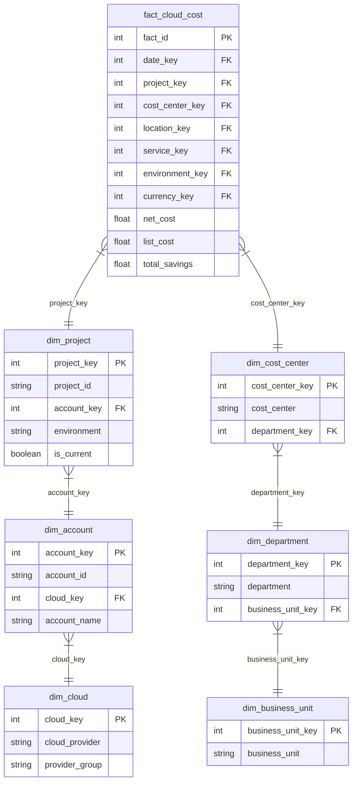

# Phase 5 Data Warehouse: Snowflake Schema Documentation

## 1. Overview & Normalization Strategy

While the **Star Schema** maintains denormalized dimensions for maximum query speed and minimal joins, the **Snowflake Schema** normalizes dimension tables into hierarchical sub-dimensions.

This reduces data redundancy, enforces strict structural normalization, and simplifies hierarchical updates across parent categories.

---

## 2. Snowflake Schema Diagram (Mermaid)

---

## 3. Normalized Hierarchies

### Hierarchy 1: Organization Structure
- **Level 1**: `dim_business_unit` (`business_unit_key` PK, `business_unit`)
- **Level 2**: `dim_department` (`department_key` PK, `business_unit_key` FK, `department`)
- **Level 3**: `dim_cost_center` (`cost_center_key` PK, `department_key` FK, `cost_center`)

### Hierarchy 2: Cloud Infrastructure Hierarchy
- **Level 1**: `dim_cloud` (`cloud_key` PK, `cloud_provider`, `provider_group`)
- **Level 2**: `dim_account` (`account_key` PK, `cloud_key` FK, `account_id`)
- **Level 3**: `dim_project` (`project_key` PK, `account_key` FK, `project_id`)

---

## 4. Star Schema vs Snowflake Schema Comparison

| Dimension | Star Schema | Snowflake Schema |
|---|---|---|
| **Structure** | Single denormalized table per dimension (e.g. `dim_organization` contains BU, Dept, Cost Center) | Multi-level normalized sub-dimensions (`dim_business_unit` -> `dim_department` -> `dim_cost_center`) |
| **Joins Required** | 1 join per dimension from fact table | Multi-level chained joins (`fact` -> `cost_center` -> `department` -> `business_unit`) |
| **Storage & Redundancy** | Higher attribute redundancy inside dimensions | Maximum normalization, zero attribute redundancy |
| **Query Performance** | Faster for aggregations and dashboard queries | Slightly slower due to multi-table join depth |
| **Maintenance** | Single table updates | Clean cascade updates across sub-dimension tables |
