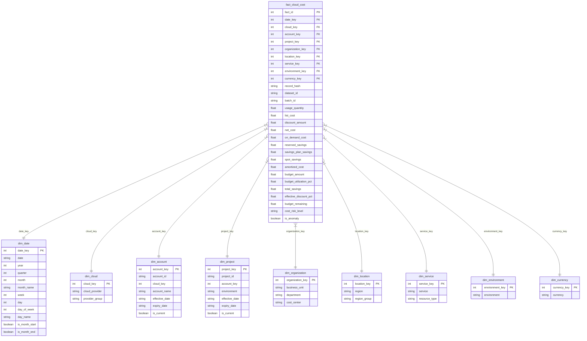

# Phase 5 Data Warehouse: Star Schema Documentation

## 1. Overview & Business Process

The **Star Schema** models the business process of **Cloud Spending and Billing Analysis**.
The central fact table `fact_cloud_cost` captures granular cost line items from multi-cloud providers (AWS, GCP, Azure), while surrounding dimension tables provide rich contextual dimensions.

### Defined Fact Grain
> **ONE ROW REPRESENTS ONE CLOUD COST RECORD FOR A SPECIFIC DATE, ACCOUNT, PROJECT, ENVIRONMENT, PROVIDER, REGION, SERVICE, AND RESOURCE TYPE.**

---

## 2. Star Schema Diagram (Mermaid)

---

## 3. Dimension Specifications & Surrogate Keys

### Surrogate Key Strategy vs Natural Keys
- **Surrogate Keys**: Integer keys generated during warehouse ETL (e.g., `20230101` for dates, `1`, `2`, `3` auto-increment integer IDs for entities). Used exclusively for internal joins between facts and dimensions for optimal performance and SCD Type 2 tracking.
- **Natural Keys**: Business keys originating from source systems (e.g., `account_id` = "acc-8831", `project_id` = "prj-analytics"). Preserved inside dimension attributes for drill-down and business queries.
- **Unknown Member Strategy**: Every dimension contains a default record at `Key = 0` (e.g., `UNKNOWN`, `N/A`) so missing source keys map cleanly to `0` without causing fact foreign key resolution failures.

### Dimension Table Schemas

#### 1. `dim_date`
- `date_key` (PK, int): YYYYMMDD integer surrogate key (e.g., `20260115`)
- `date` (string): Standard ISO date YYYY-MM-DD
- `year`, `quarter`, `month`, `week`, `day`, `day_of_week` (int)
- `month_name`, `day_name` (string): e.g. "January", "Monday"
- `is_month_start`, `is_month_end` (boolean)

#### 2. `dim_cloud`
- `cloud_key` (PK, int)
- `cloud_provider` (string): AWS, AZURE, GCP
- `provider_group` (string): Multi-Cloud Category

#### 3. `dim_account` (SCD Type 2 Ready)
- `account_key` (PK, int)
- `account_id` (string): Natural Key
- `cloud_key` (FK, int)
- `account_name` (string)
- `effective_date`, `expiry_date` (string), `is_current` (boolean)

#### 4. `dim_project` (SCD Type 2 Ready)
- `project_key` (PK, int)
- `project_id` (string): Natural Key
- `account_key` (FK, int)
- `environment` (string)
- `effective_date`, `expiry_date` (string), `is_current` (boolean)

#### 5. `dim_organization`
- `organization_key` (PK, int)
- `business_unit` (string): e.g., "Digital Products"
- `department` (string): e.g., "Engineering"
- `cost_center` (string): e.g., "CC-101"

#### 6. `dim_location`
- `location_key` (PK, int)
- `region` (string): e.g., "us-east-1"
- `region_group` (string): e.g., "US Americas"

#### 7. `dim_service`
- `service_key` (PK, int)
- `service` (string): e.g., "Amazon EC2", "BigQuery"
- `resource_type` (string): e.g., "ComputeInstance", "StorageBucket"

#### 8. `dim_environment`
- `environment_key` (PK, int)
- `environment` (string): "prod", "staging", "development"

#### 9. `dim_currency`
- `currency_key` (PK, int)
- `currency` (string): "USD"
